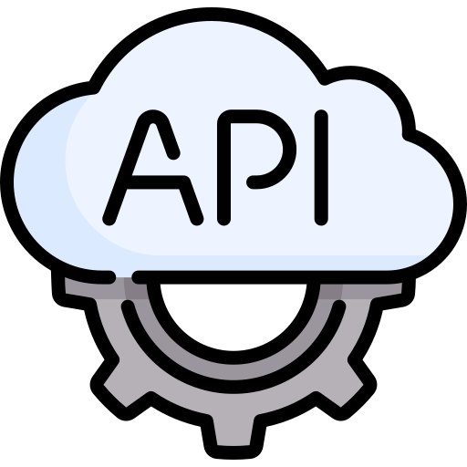

[//]: # ([![MasterHead](./img/developer3.gif)](https://rishavchanda.io))
[//]: # ([![Sarthak's GitHub activity graph](https://activity-graph.herokuapp.com/graph?username=TursunboyevJahongir&&theme=xcode)](https://github.com/TursunboyevJahongir))

<h1 align="center">Hi there 👋</h1>

[//]: # ()
[//]: # ()

[//]: # (![GitHub-Mark-Light]&#40;./img/developer.gif#gh-light-mode-only&#41;)
[//]: # (![GitHub-Mark-Dark]&#40;https://camo.githubusercontent.com/cae12fddd9d6982901d82580bdf321d81fb299141098ca1c2d4891870827bf17/68747470733a2f2f6d69726f2e6d656469756d2e636f6d2f6d61782f313336302f302a37513379765349765f7430696f4a2d5a2e676966#gh-dark-mode-only&#41;)

- 🤖 I like coding. I'm a **Php Developer**
- 🔭 I’m currently working on [Pos system](daftar.uz)
- 🌱 I’m currently learning **SwiftUi**
- 📄 Know about my experiences [linkedin](https://www.linkedin.com/in/jahongir-tursunboyev-backend-php-laravel/)
- ⚡ Fun fact **I love solving complex problems and travel.**
- 🏃 I love sport: Ping pong 🏓, football ⚽, basketball🏀, chess♟
- 🥅 2022 Goals: Learn Swift,SwiftUi

<h3 align="left">Connect with me:</h3>

<h3 align="left">Languages and Tools:</h3>

 

<b style="color:#355C7D;font-size:20px">And</b>

<b style="color:#1A1B27;font-size:20px">Account details</b>

&nbsp;

